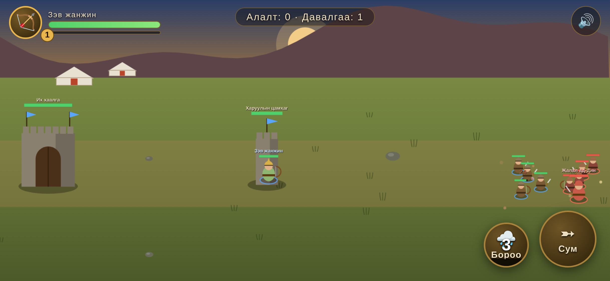

# Их Монгол — Тулааны Талбар ⚔️

**Mobile Legends маягийн, монгол сэдэвт тулааны тоглоом.** Чингис хаан болон түүний жанждыг удирдан, Хорезмын их хаалгыг нурааж ялалт байгуул!

A Mongolian-themed, Mobile Legends-style lane-battle game featuring Chinggis Khaan and his generals. Fully in the Mongolian language. iPhone-first (iPhone X and newer).



---

## 📱 Native iOS хувилбар (гол хувилбар) — `ios/`

Swift + SpriteKit дээр бичигдсэн жинхэнэ native iPhone тоглоом.

- **Шаардлага:** Mac компьютер + [Xcode 15 буюу түүнээс дээш](https://apps.apple.com/app/xcode/id497799835) (үнэгүй), iPhone X-ээс дээш утас (iOS 15+)
- iPhone-д зориулсан, хөндлөн (landscape) байрлалтай
- Гар утасны мэдрэгч удирдлага: виртуал жойстик + чадварын товчнууд
- Хаптик (чичиргээт) мэдрэмж бүхий цохилтууд

### Хэрхэн ажиллуулах вэ

1. Энэ repo-г Mac дээрээ татаж авна:
   ```bash
   git clone <repo-url>
   ```
2. `ios/IkhMongol.xcodeproj` файлыг Xcode-оор нээнэ
3. Project Settings → **Signing & Capabilities** хэсэгт өөрийн Apple ID-гаа **Team** болгож сонгоно (үнэгүй Apple ID болно)
4. Утсаа кабелаар залгаад, дээд талын төхөөрөмжийн жагсаалтаас өөрийн iPhone-оо сонгоно
5. **▶ Run** товч дарна — тоглоом утсан дээр чинь суугдана
6. Утсан дээрээ анх удаа ажиллуулахдаа: **Тохиргоо → Ерөнхий → VPN ба төхөөрөмжийн удирдлага** хэсгээс өөрийн Apple ID-д итгэх (Trust), мөн iOS 16+ бол **Нууцлал ба аюулгүй байдал → Хөгжүүлэгчийн горим** (Developer Mode)-ыг асаана

> 💡 Үнэгүй Apple ID ашиглавал апп 7 хоног тутамд дахин суулгах шаардлагатай. App Store болон TestFlight-д байршуулахын тулд жилийн $99-ын Apple Developer Program хэрэгтэй.

---

## 🌐 Веб демо (шууд тоглох боломжтой) — `web/`

Native хувилбарыг угсрахад Mac хэрэгтэй тул **яг одоо iPhone дээрээ туршаад үзэх** веб хувилбарыг мөн хийсэн. Тоглоомын агуулга нь native хувилбартай ижил.

- iPhone-ийнхээ Safari дээр нээгээд л тоглоно (iPhone X ба түүнээс дээш бүх утсанд ажиллана)
- **Share → Add to Home Screen** хийвэл жинхэнэ апп шиг бүтэн дэлгэцээр ажиллана

### Хэрхэн нээх вэ

- **GitHub Pages** (санал болгож буй арга): Repo Settings → Pages → Branch сонгоод идэвхжүүлбэл `https://<username>.github.io/<repo>/web/` хаягаар тоглож болно
- **Локал сервер:**
  ```bash
  cd web && python3 -m http.server 8080
  # утаснаасаа http://<компьютерийн-IP>:8080 хаягаар орно
  ```

---

## 🎮 Тоглоомын заавар

**Зорилго:** Дайсны **Их хаалга**-ыг нураах. Өөрийн хаалгаа алдвал ялагдана.

| Удирдлага | Үйлдэл |
|---|---|
| Дэлгэцийн зүүн тал | Виртуал жойстик — баатраа хөдөлгөнө |
| Баруун доод товчнууд | Чадварууд (cooldown-тэй) |
| Энгийн довтолгоо | Автомат — дайсан ойртоход өөрөө цохино |
| Өөрийн хаалганы дэргэд | Амь аажмаар сэргэнэ |

Цэргийн давалгаа 17 секунд тутамд хоёр талаас гарна. Дайсан алж туршлага цуглуулбал түвшин ахиж, хүч чадал нэмэгдэнэ. Дайсны талыг **Жалал ад-Дин** хунтайж (AI) удирдана.

### Баатрууд

| Баатар | Үүрэг | Чадвар 1 | Чадвар 2 |
|---|---|---|---|
| **Чингис хаан** ⚔️ | Тулаанч | Сэлмийн хуй — тойрсон цохилт | Тэнгэрийн ивээл — эдгэрэлт + хурд |
| **Зэв жанжин** 🏹 | Харваач | Нэвтлэх сум — шугамын цохилт | Сумны бороо — талбайн цохилт |
| **Сүбээдэй баатар** 🛡 | Хамгаалагч | Шуурган довтолгоо — ухасхийлт + зогсоолт | Төмөр бамбай — хохирол шингээгч |

---

## 🛠 Техникийн мэдээлэл

| | Native iOS | Веб демо |
|---|---|---|
| Технологи | Swift 5, SpriteKit, SwiftUI | HTML5 Canvas, Vanilla JS |
| Хамгийн бага хувилбар | iOS 15 (iPhone X дэмжинэ) | iOS Safari 13+ |
| Гадаад сан | Байхгүй — цэвэр Apple SDK | Байхгүй — нэг файл |
| Байрлал | Хөндлөн (landscape) | Хөндлөн (санал болгоно) |

Бүх дүрс кодоор зурагдсан (asset шаардлагагүй) тул төсөл маш хөнгөн.

## 🗺 Цаашдын санаанууд

- [ ] Олон баатар нэмэх (Мухулай, Боорчи, Хасар...)
- [ ] Дуу хөгжим, авианы эффект (native)
- [ ] Хэцүү байдлын түвшин
- [ ] Game Center амжилтууд
- [ ] Онлайн PvP горим
